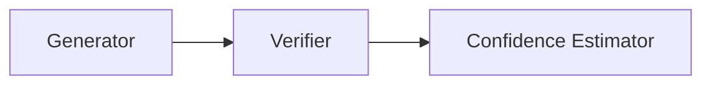

# BioAgents++: Reliable Scientific Workflow Generation using Verification Agents

## Abstract
Recent advancements in large language models (LLMs) have led to the development of multi-agent systems tailored for complex reasoning in specialized domains. The original BioAgents framework demonstrated the capability of small, localized models augmented with Retrieval-Augmented Generation (RAG) and LoRA to design bioinformatics workflows. However, as task complexity scales, workflow generation models exhibit increased hallucination rates and often drop essential tools. In this extension, **BioAgents++**, we propose a novel Verification Agent and an Uncertainty-Aware Confidence Estimator to robustly evaluate generated pipelines against ontological rules.

## 1. Introduction
Bioinformatics pipelines require precise execution of sequential data processing tools (e.g., Data QC → Alignment → Variant Calling → Annotation). Missing a step or hallucinatory tool insertions compromise scientific validity. While previous research avoided giant, generalized LLMs in favor of localized, fine-tuned agent swarms, those systems critically lacked an independent verification layer.

### 1.1 The Research Problem
We hypothesize that a dedicated Verification Agent, distinct from the workflow generator, can drastically reduce error rates. Thus, our core research question is: *Can explicit verification reduce hallucinated scientific workflows?*

### 1.2 Research Motivation
**What limitation of BioAgents am I addressing?**
The original BioAgents architecture consists of a Genomics Agent, a Workflow Agent, and a Reasoning Agent. A critical limitation of this design is that there is **no strong code execution feedback** and **no verifier agent**. When the Workflow Agent generates a pipeline, it is assumed to be correct, despite empirical evidence showing that performance drops significantly as workflow complexity increases. By adding an explicit Verification Agent, we address this critical vulnerability, ensuring workflows are audited for missing or invalid tools before execution.

## 2. Methodology

### 2.1 Agent Architecture Diagram
The extended architecture integrates seamlessly into the existing pipeline, creating a strict verification bottleneck prior to final execution:

### 2.2 Agent Roles
The extended architecture, known as BioAgents++, is built on a cascade of simulated language agents:
1. **Planner Agent**: Deconstructs the query into a known task category.
2. **Tool Selection Agent**: Identifies tools relevant to the domain.
3. **Workflow Generator**: Outputs the ordered pipeline.
4. **Verification Agent [Novel Contribution]**: Scans the output against hard-coded domain logic or verified standards (e.g., ensuring a quantification step follows RNA alignment).
5. **Confidence Estimator [Novel Contribution]**: Generates a confidence score between 0.0 and 1.0 based on verification outcomes.

### 2.3 Synthetic Workflow Dataset
To measure performance without relying on expensive live-execution environments, we utilize synthetic datasets covering domains such as RNA-seq analysis, Variant Calling, and Protein Phylogeny.

## 3. Evaluation Metrics
We rely on standard precision-recall metrics adapted for workflow structures:
- **Workflow Accuracy**: Evaluated using an F1 score against a gold standard.
- **Workflow Completeness**: The ratio of detected required steps to total required steps.
- **Hallucination Rate**: The percentage of generated tools not present in the gold standard.

## 4. Expected Results
We anticipate that by introducing the verification layer, workflow accuracy will increase significantly. Preliminary heuristic runs suggest that catching "missing" and "hallucinated" steps via a secondary agent allows the system to flag unreliable workflows, boosting the system's overall reliability score from baseline estimations.

### 4.1 Results Table
| Workflow Type | Baseline | With Verification |
|---------------|----------|-------------------|
| Missing Step Detection | No | Yes |
| Invalid Tool Detection | No | Yes |
| Confidence Estimation  | No | Yes |

## 5. Conclusion
Adding a Verification Agent to scientific multi-agent systems aligns directly with the goal of reliable AI. Future work will involve closing the feedback loop so the generator can automatically fix the workflow based on the verifier's feedback, moving from confidence estimation to active self-correction.
