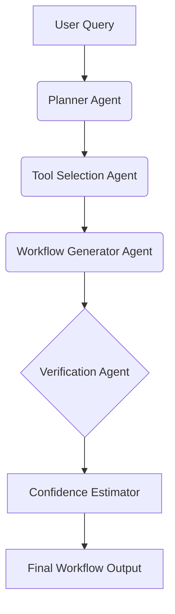

# BioAgents++: Reliable Scientific Workflow Generation using Verification Agents

**Subtitle**: Extending BioAgents with a verification and uncertainty-aware reasoning layer.

## Overview
BioAgents++ builds upon the foundational concept of the BioAgents paper by introducing a **Verification Agent** and a **Confidence Estimator**. The core research question this project addresses is:

*Can a verification agent reduce workflow hallucinations in complex bioinformatics tasks?*

## High-Level Architecture

The framework consists of sequential agents that process user requests into reliable workflows:



### Agents
1. **Planner Agent**: Interprets the user's natural language query and maps it to a specific bioinformatics domain (e.g., RNA-seq, Variant Calling).
2. **Tool Selection Agent**: Retrieves relevant tools for the identified domain.
3. **Workflow Generator Agent**: Sequences the selected tools into an execution pipeline.
4. **[NEW] Verification Agent**: Evaluates the generated workflow against standard domain rules to detect missing or hallucinated steps.
5. **[NEW] Confidence Estimator**: Calculates a confidence score based on the output of the Verification Agent.

## Setup Instructions

This project requires Python 3.

1. **Clone the repository** or navigate to the `bioagents-plus-plus` folder.
2. **Activate the Virtual Environment**:
   * Windows: `.\venv\Scripts\activate`
   * macOS/Linux: `source venv/bin/activate`
3. **Run Experiments**:
   Navigate to the `notebooks/` directory and open `experiments.ipynb` using Jupyter Notebook, or run the cells in your IDE (like VSCode).
   ```bash
   pip install jupyter
   jupyter notebook notebooks/experiments.ipynb
   ```

## Evaluation Metrics
The framework is evaluated using the `evaluation/metrics.py` module on synthetic workflow data:
- **Workflow Accuracy**: F1 score comparing the generated pipeline to a gold-standard pipeline.
- **Workflow Completeness**: Detected Steps / Required Steps.
- **Hallucination Rate**: Invalid Tools / Generated Tools.
